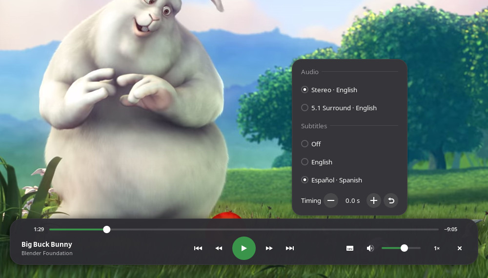

# Media Controls

**A proper control bar for fullscreen video on GNOME — drawn by the shell itself.**


A GNOME Shell extension that puts a seek bar, play/pause, skip, volume, speed —
and, for VLC, audio tracks, subtitles, subtitle timing and chapters — over
whatever video you're watching full screen. Move the mouse and it rises from
the bottom; leave it and it's gone. Press a key and drive it from the keyboard.
Pick up a game controller and drive it from the sofa.

**It isn't a player.** VLC, mpv, Celluloid — whatever you already use — keeps
doing the playing. The bar talks to it over MPRIS, the same standard GNOME's own
media controls use, so it works the same way over every player and replaces the
one each of them draws for itself.

---

## What it does

- **Looks like GNOME, because it is GNOME.** The sliders are the quick
  settings' sliders, the buttons are the shell's buttons, the pop-out is the
  shell's own menu, and everything follows your accent colour.
- **Audio, subtitles and their timing.** Pick the audio track and the subtitles
  from a pop-out, and nudge subtitles that are out of sync with − and + until
  they line up. Chapters too, when the file has them. (VLC; see below.)
- **Mouse, keyboard or controller.** Every input speaks the same set of
  actions. A controller can move a highlight around the bar like a TV remote,
  and every one of its buttons can also be given an action of its own.
- **Any controller.** Xbox, PlayStation, Switch, 8BitDo, Steam Deck — pads are
  read through libmanette, GNOME's gamepad library, which knows hundreds of
  them. Buttons are matched by where they sit, not what's printed on them.
- **Sized for the room.** One slider makes the whole bar bigger for a TV across
  the room.
- **For the sofa, and for bed.** An optional clock with the time the video will
  end, and an optional sleep timer that pauses after 15 minutes to 2 hours, or
  at the end of the file.
- **Knows which player you mean.** The bar belongs to the player whose window
  is full screen and focused, matched to its process. Nothing else on screen
  reacts, so a controller in a game never pauses your film.
- **Stays out of the way.** It only watches the pointer while a fullscreen
  player has focus, never polls the player, and never makes a call that could
  hang the desktop waiting on a busy one.

## What it is not

- Not a player, and not a replacement for one.
- Not for browsers — a fullscreen video in a browser has its own controls, so
  browsers are left alone by default (you can turn them on).

---

## Getting started

### 1. Check you're on a supported GNOME

GNOME Shell **48, 49 or 50**. Game controllers also need **libmanette**, which
most GNOME systems already have (WebKitGTK depends on it) — `make status` will
tell you.

### 2. Install it

```bash
git clone https://github.com/Jackicus/Gnome-Extension-Media-Controls.git
cd Gnome-Extension-Media-Controls
make install
```

Then **log out and back in** — GNOME only notices a brand-new extension at
login — and turn it on:

```bash
gnome-extensions enable media-controls@jackt
```

### 3. Set VLC up (once)

Open the preferences (`gnome-extensions prefs media-controls@jackt`), go to
**Players**, and switch on both VLC options:

- **Hide VLC's own fullscreen controls**, so the bar is the only one over the
  video however VLC was opened.
- **Audio and subtitle tracks**, which lets the bar list and switch VLC's
  tracks, move the subtitle timing and step through chapters.

Both change VLC's own settings file and take effect the next time VLC starts.
If you'd rather use the command line, the same thing is:

```bash
vlc --no-qt-fs-controller --extraintf oldrc --rc-fake-tty \
    --rc-unix "$XDG_RUNTIME_DIR/media-controls-vlc.sock" --fullscreen FILE
```

### 4. Play something full screen

That's it. Move the mouse.

---

## Using it


**Mouse** — move the pointer over the video and the bar rises; it goes three
seconds after the pointer stops (unless the pointer is on it, or you've paused).
Click the slider to jump, drag it to scrub, scroll on it to skip. Click the
speed to step through 0.5× – 2×. The ✕ closes the player.

**Keyboard** — **Super+C** opens the bar holding the keyboard. The arrow keys
move the highlight, Enter presses, Escape backs out.

**Controller** — press **Start** to open the bar the same way: the d-pad moves
the highlight, the bottom button presses, the right button backs out. The other
buttons do their own thing all the time. By default:

| Button | Does |
|---|---|
| Start | Move around the bar |
| A · Cross (bottom) | Play or pause |
| Y · Triangle (top) | Audio and subtitles |
| D-pad left / right | Skip back / forward 10 seconds |
| D-pad up / down | Volume up / down |
| LB · L1 / RB · R1 | Previous / next |
| LT · L2 / RT · R2 | Slower / faster |
| X · Square (left) | Mute |
| B · Circle (right) | Hide the bar |

Every one of them can be changed, and there are more actions to give them —
next audio track, next subtitle track, subtitles earlier or later, the sleep
timer. The subtitle ones leave the bar down, so the subtitles stay in view
while you line them up.

### Audio, subtitles and timing



The button beside the volume opens the audio-and-subtitles pop-out. Picking a
track leaves it open, so you can choose the audio and the subtitles in one go.
**Timing** moves the subtitles 0.1 s earlier (−) or later (+) per press —
VLC shows the exact delay on screen as you go — and ↺ puts them back. Files
with chapters get a chapter row with ‹ ›. It works paused as well as playing.

---

## Preferences

```bash
gnome-extensions prefs media-controls@jackt
```

<table>
  <tr>
    <td width="33%"></td>
    <td width="33%"></td>
    <td width="33%"></td>
  </tr>
  <tr>
    <td valign="top"><b>Bar</b> — when the pointer brings it up (anywhere,
    near the bottom, or never), how long it stays, the keyboard shortcut, the
    <b>size</b>, the <b>clock</b> ("21:40 · ends at 23:12") and the <b>sleep
    timer</b> — both off to begin with — and the size of a skip and a volume
    step.</td>
    <td valign="top"><b>Players</b> — every media player running right now,
    with a switch for whether the bar appears over it (browsers start off),
    and the two VLC switches from Getting started.</td>
    <td valign="top"><b>Controllers</b> — every pad plugged in, with a switch
    each. Press a button and its row lights up, along with the button's row
    below — so you can tell which pad is which, and see what that button
    does.</td>
  </tr>
</table>

---

## Players

Anything that shows up in GNOME's own media controls gets the bar: play and
pause, seeking, skipping, volume, speed, previous and next. **VLC** also gets
the audio-and-subtitles pop-out, through its remote-control socket (step 3
above); other players don't offer tracks to anyone else, so their bar simply
has no such button.

- **VLC** — tested. Turn its own fullscreen bar off (step 3) so only one shows.
- **mpv** — needs the [mpv-mpris](https://github.com/hoyon/mpv-mpris) plugin,
  and `--no-osc` to hide mpv's own controls.
- **Celluloid, Haruna, SMPlayer** — speak MPRIS, so they should work; they draw
  fullscreen controls of their own as well.

The bar only ever attaches to the player that owns the **focused, fullscreen**
window. With two players open it's the one you're looking at; with none full
screen, it isn't anywhere at all.

---

## Everyday commands

You never need these — the preferences do the same things — but they're handy.

| Command | Does |
|---|---|
| `make status` | What's installed, whether it's enabled, whether controllers will work |
| `make devices` | Every media player and every controller the extension can see right now |
| `make logs` | Follow the shell journal, filtered to this extension |
| `make uninstall` | Remove it |

Something not showing up? `make logs` first — a GNOME extension's errors go to
the system journal, never to a terminal.

---

## Development

`CLAUDE.md` is the real design document: how the pieces fit together, why each
decision went the way it did, and the traps that bite.

```bash
# Symlink src/ into the extensions dir, so edits are live
make link

# Apply your edits (recompiles schemas, disable/enable, no shell restart)
make reload

# Follow shell logs, filtered to Media Controls
make logs
```

`make link` is the one to use while working in this repo. Run it once; after
that `make reload` picks up every edit straight from `src/`. Edits to
`extension.js` or `metadata.json` still need a full log out and back in.

| Command | Does |
|---|---|
| `make install` | Clean copy into the extensions dir (a real install, not a symlink) |
| `make stalls` | Watch for desktop freezes and log what stalled, with timestamps |
| `make pack` | Build `dist/media-controls@jackt.shell-extension.zip` |
| `make clean` | Drop compiled schemas and `dist/` |

### Seeing it

The bar is drawn over a fullscreen window, so a change can only be verified by
looking at it. `scripts/nested.sh` runs a throwaway **nested GNOME Shell** with
a live mirror on the real desktop, plays a test clip in VLC inside it, plugs in
a virtual Xbox pad, and takes screenshots — see `CLAUDE.md` and the
`drive-extension` skill before using it.

| Command | Does |
|---|---|
| `./scripts/nested.sh start --clean` | Start it with a settings database of its own: only this extension, nothing written to yours |
| `./scripts/nested.sh player` | Play a generated test clip (two audio tracks, two subtitle tracks, chapters) in VLC inside it |
| `./scripts/nested.sh pad start dpad-right south` | Plug in a virtual Xbox pad and press those buttons |
| `make preview` | Start it (if not already running) and take a screenshot |
| `make nested-stop` | Tear it down — always run this when finished |

---

## Credits

The film in the screenshots is [Big Buck Bunny](https://peach.blender.org/)
© 2008 Blender Foundation, licensed under
[Creative Commons Attribution 3.0](https://creativecommons.org/licenses/by/3.0/).
Its audio and subtitle tracks in the pop-out were added for the demonstration.
