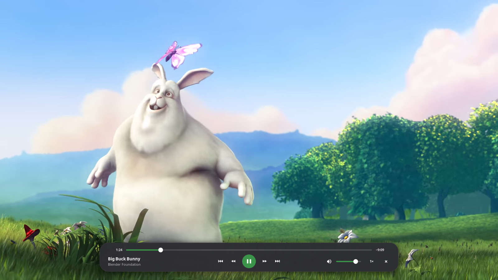
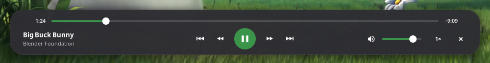
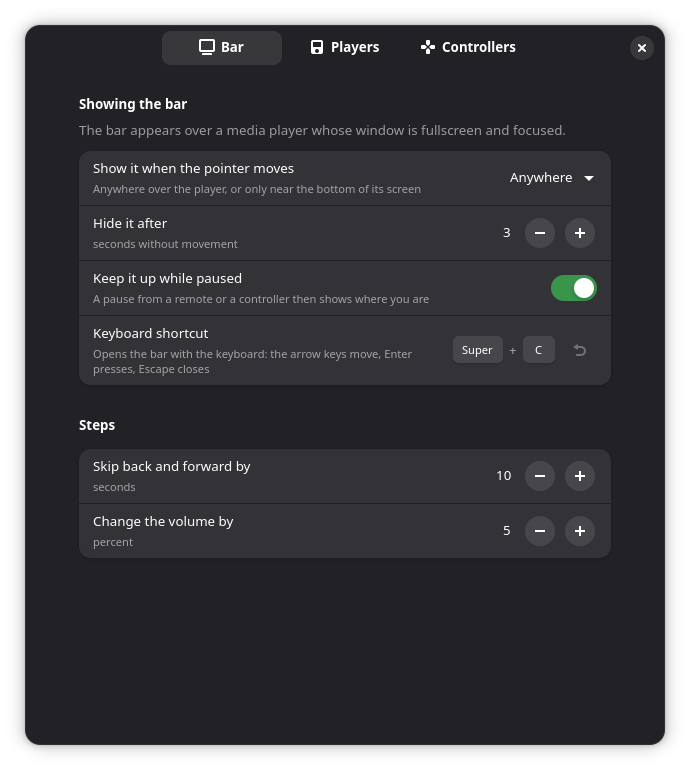
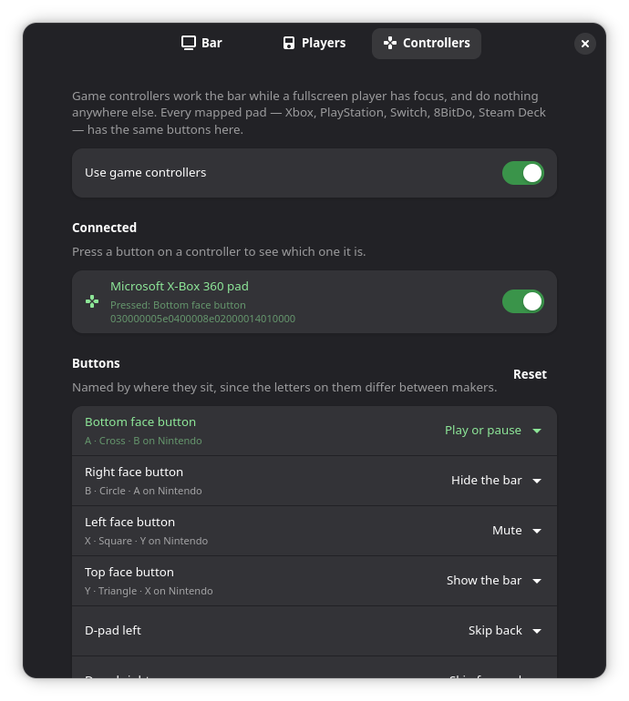
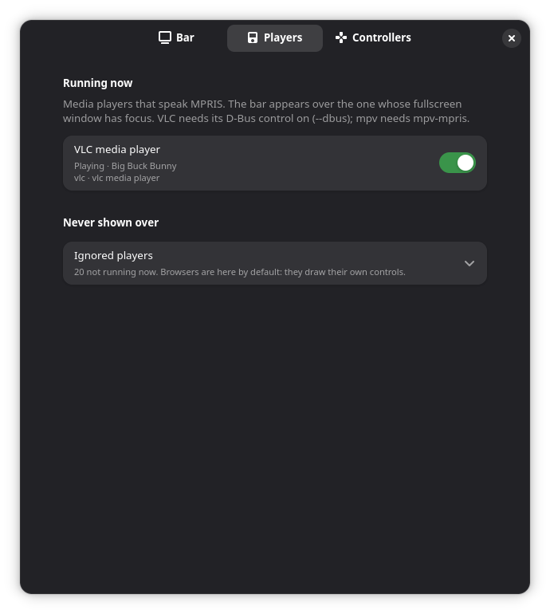

# Media Controls

**A proper control bar for fullscreen video on GNOME — drawn by the shell itself.**



A GNOME Shell extension that puts a seek bar, play/pause, skip, volume and
speed over whatever video you're watching full screen. Move the mouse and it
rises from the bottom; leave it and it's gone. Press a key and drive it from the
keyboard. Pick up a game controller and drive it from the sofa.

**It isn't a player.** VLC, mpv, Celluloid — whatever you already use — keeps
doing the playing. The bar just talks to it over MPRIS, the same standard
GNOME's own media controls use, so it works the same way over every player
and replaces the one each of them draws for itself.

---

## What it does

- **Looks like GNOME, because it is GNOME.** The sliders are the quick
  settings' sliders, the buttons are the shell's buttons, the panel is painted
  the way the shell paints its volume pop-up, and everything follows your accent
  colour and your text size.
- **Mouse, keyboard or controller.** Every input speaks the same set of
  actions, and every button on a controller can be given any of them.
- **Any controller.** Xbox, PlayStation, Switch, 8BitDo, Steam Deck — pads are
  read through libmanette, GNOME's gamepad library, which knows hundreds of
  them. Buttons are matched by where they sit, not what's printed on them.
- **Knows which player you mean.** Two players open? The bar belongs to the one
  whose window is full screen and focused, matched to its process. Nothing else
  on screen reacts, so a controller in a game never pauses your film.
- **Shows what the player does by itself.** Pause from a remote's media keys or
  the player's own shortcuts and the bar comes up to show where you are, and
  stays until you play again.
- **Stays out of the way.** It only watches the pointer while a fullscreen
  player has focus, never polls the player, never makes a call that could hang
  the desktop waiting on a busy one, and runs no background process of its own.

## What it is not

- Not a player, and not a replacement for one.
- Not for browsers — a fullscreen video in a browser has its own controls, so
  browsers are left alone by default (you can turn them on).
- No audio or subtitle track picker, and no chapter list. Players don't offer
  those over MPRIS, so nothing built on it can show them.

---

## Getting started

### 1. Check you're on a supported GNOME

GNOME Shell **48, 49 or 50**. Game controllers also need **libmanette**, which
most GNOME systems already have (WebKitGTK depends on it) — `make status` will
tell you.

```bash
gnome-shell --version
```

### 2. Install it

```bash
git clone https://github.com/Jackicus/Gnome-Extension-Media-Controls.git
cd Gnome-Extension-Media-Controls
make install
```

Then **log out and back in** — GNOME only notices a brand-new extension at
login — and turn it on:

```bash
gnome-extensions enable media-controls@jackt
```

### 3. Set your player up

Anything that shows up in GNOME's own media controls works. For **VLC**, turn
off its own fullscreen bar and its own "continue where you left off":

```bash
vlc --fullscreen --no-qt-fs-controller --qt-continue=0 FILE
```

— or use `cvlc`, which has no bar at all. VLC's D-Bus control is on by default
(`--dbus`). **mpv** needs the [mpv-mpris](https://github.com/hoyon/mpv-mpris)
plugin. Celluloid speaks MPRIS as it comes.

### 4. Play something full screen

That's it. Move the mouse.

---

## Using it



**Mouse** — move the pointer over the video and the bar rises; it goes three
seconds after the pointer stops (unless the pointer is on it). Click the slider
to jump, drag it to scrub, scroll on it to skip. Click the speed to step
through 0.5× – 2×. The ✕ closes the player.

**Keyboard** — **Super+C** opens the bar holding the keyboard. The arrow keys
move between its buttons (Left and Right on the slider skip), Enter presses
one, Escape or Super+C again puts it away.

**Controller** — by default:

| Button | Does |
|---|---|
| A · Cross (bottom) — and Start | Play or pause |
| D-pad left / right | Skip back / forward 10 seconds |
| D-pad up / down | Volume up / down |
| LB · L1 / RB · R1 | Previous / next |
| LT · L2 / RT · R2 | Slower / faster |
| X · Square (left) | Mute |
| Y · Triangle (top) | Show the bar |
| B · Circle (right) | Hide the bar |

Every one of them can be changed, and any button left over can be given an
action of its own.

---

## Preferences

```bash
gnome-extensions prefs media-controls@jackt
```

<table>
  <tr>
    <td width="50%"></td>
    <td width="50%"></td>
  </tr>
  <tr>
    <td><b>Bar</b> — when the pointer brings it up (anywhere, only near the
    bottom, or never), how long it stays, whether it waits while you're paused,
    the keyboard shortcut, and the size of a skip and a volume step.</td>
    <td><b>Controllers</b> — every pad plugged in, with a switch each. Press a
    button and its row lights up, along with the button's row below — so you
    can tell which pad is which, and see what that button does.</td>
  </tr>
</table>



**Players** — every media player running right now, with a switch for whether
the bar appears over it. Browsers start switched off, because a video in a
browser draws its own controls. A player you switch off stays off when it
isn't running, in the folded list below.

The bar only ever attaches to the player that owns the **focused, fullscreen**
window. With two players open, it's the one you're looking at; with none full
screen, it isn't anywhere at all.

<br clear="right">

---

## Everyday commands

You never need these — the preferences do the same things — but they're handy.

| Command | Does |
|---|---|
| `make status` | What's installed, whether it's enabled, whether controllers will work |
| `make devices` | Every media player and every controller the extension can see right now |
| `make logs` | Follow the shell journal, filtered to this extension |
| `make uninstall` | Remove it |

Something not showing up? `make logs` first — a GNOME extension's errors go to
the system journal, never to a terminal.

---

## Development

`CLAUDE.md` is the real design document: how the pieces fit together, why each
decision went the way it did, and the traps that bite.

```bash
# Symlink src/ into the extensions dir, so edits are live
make link

# Apply your edits (recompiles schemas, disable/enable, no shell restart)
make reload

# Follow shell logs, filtered to Media Controls
make logs
```

`make link` is the one to use while working in this repo. Run it once; after
that `make reload` picks up every edit straight from `src/`. Edits to
`extension.js` or `metadata.json` still need a full log out and back in.

| Command | Does |
|---|---|
| `make install` | Clean copy into the extensions dir (a real install, not a symlink) |
| `make stalls` | Watch for desktop freezes and log what stalled, with timestamps |
| `make pack` | Build `dist/media-controls@jackt.shell-extension.zip` |
| `make clean` | Drop compiled schemas and `dist/` |

### Seeing it

The bar is drawn over a fullscreen window, so a change can only be verified by
looking at it. `scripts/nested.sh` runs a throwaway **nested GNOME Shell** with
a live mirror on the real desktop, plays a test clip in VLC inside it, plugs in
a virtual Xbox pad, and takes screenshots — see `CLAUDE.md` and the
`drive-extension` skill before using it.

| Command | Does |
|---|---|
| `make nested` | Start the nested shell, with a live mirror window on the desktop |
| `./scripts/nested.sh start --clean` | The same with a settings database of its own: only this extension, nothing written to yours |
| `./scripts/nested.sh player` | Play a generated test clip in VLC, full screen, inside it |
| `./scripts/nested.sh pad south dpad-right` | Plug in a virtual Xbox pad and press those buttons |
| `make preview` | Start it (if not already running) and take a screenshot |
| `make nested-stop` | Tear it down — always run this when finished |

---

## Credits

The film in the screenshots is [Big Buck Bunny](https://peach.blender.org/)
© 2008 Blender Foundation, licensed under
[Creative Commons Attribution 3.0](https://creativecommons.org/licenses/by/3.0/).
